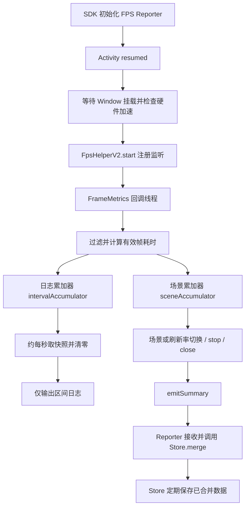
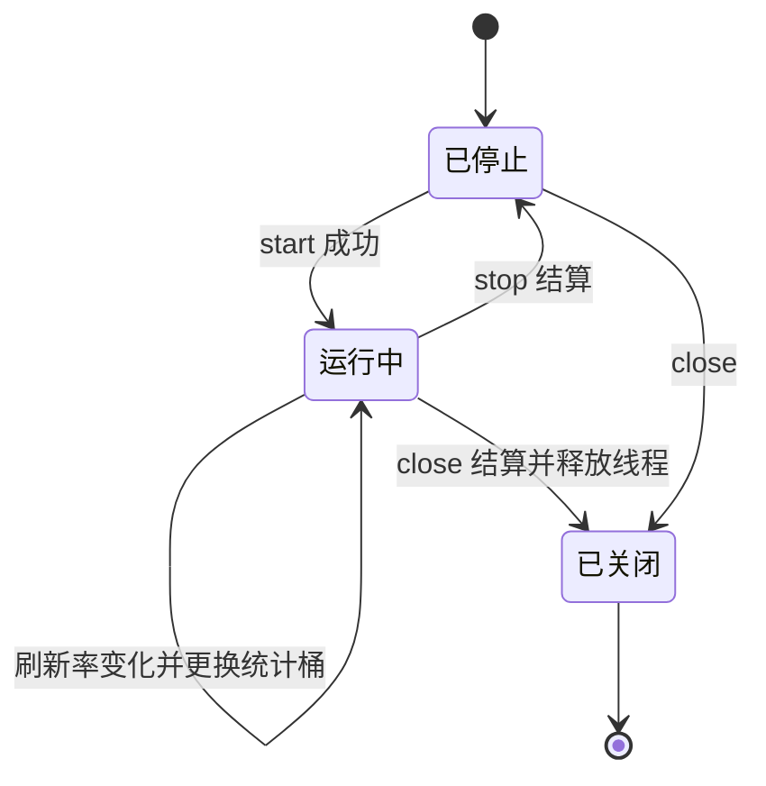
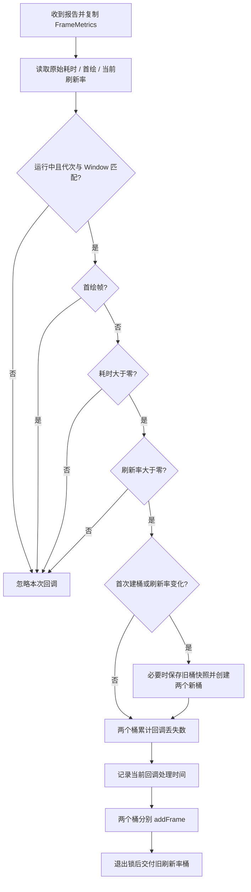

# FpsHelperV2 帧率统计逻辑与问题分析

分析日期：2026-09-14。依据当前工作区源码，包含分析开始前已有的未提交修改。

这是一份独立阅读文档，不加入知识库、不建立知识库导航关联。本次只分析和写文档，不修改统计实现。

## 1. 先看结论

**当前实现准确执行了自己定义的 `fps-v1` 公式，但该公式并不能普遍代表“每秒实际输出多少帧”。** 它计算的是：先把每个有效样本的耗时补足到一个屏幕刷新周期，再取平均耗时的倒数，并按屏幕刷新率归一化。

因此，要分两个标准判断：

| 判断标准 | 结论 |
| --- | --- |
| 是否按照当前自定义公式累加、清零和归一化 | 主体逻辑一致；没有发现每秒摘要忘记清零的问题 |
| 是否能作为真实输出 FPS | 存在根本口径问题：公式没有使用观测时间长度，也没有测量实际呈现间隔 |
| 回调丢失诊断是否完整 | 存在确定的漏计路径：被过滤的当前帧，会连带丢掉此前已丢失报告的计数 |
| 每秒日志是否等于每秒持久化 | 不等于；未结算的场景桶仍只保存在 Helper 内存中 |
| 并发、刷新率切换是否完全可靠 | 有关闭期间漏交付和刷新率归属的边界风险；本次未做运行复现 |

最重要的解释是：**`activeDurationMs` 是累计的有效帧耗时，不是活跃时间段的真实长度。** 约 1 秒的日志中出现 1706 ms 或 2134 ms，可由当前公式直接产生，不能单凭这一现象判断重复计数。

## 2. 源码地图与三个角色

主要文件：[FpsHelperV2.kt](nativelib/src/main/java/com/example/nativelib/fps/FpsHelperV2.kt)。下表行号对应本次分析版本，后续代码变化时以函数名为准。

| 类型或函数 | 大致行号 | 职责 |
| --- | --- | --- |
| `FpsWindowSummary` | 22 | 保存快照，派生毫秒、FPS、归一化 FPS、平均耗时 |
| `FpsFrameAccumulator.addFrame()` | 95 | 校验耗时、计算帧预算、累加有效耗时与帧数 |
| `snapshot()` / `snapshotAndReset()` | 117 / 136 | 生成快照；后者同时清空累加状态 |
| `FpsHelperV2.start()` | 208 | 注册 Window 监听，初始化采集代次 |
| `setScene()` | 260 | 结算旧场景、替换监听器和累加器 |
| `onFrameMetrics()` | 375 | 接收、过滤、按刷新率分桶、送入两个累加器 |
| `stopLocked()` / `close()` | 446 / 354 | 停止结算、失效旧回调、释放资源 |
| `logIntervalSummary()` | 484 | 取出并清空日志桶 |
| `emitSummary()` | 512 | 将场景桶交给上层监听器 |

外围调用参考：[FpsReporter.kt](nativelib/src/main/java/com/example/nativelib/fps/FpsReporter.kt)、[FpsEventStore.kt](nativelib/src/main/java/com/example/nativelib/fps/FpsEventStore.kt)、[PerformanceSdk.kt](nativelib/src/main/java/com/example/nativelib/PerformanceSdk.kt)。



这里有两个独立累加器，同一帧会各加一次，服务端只接收场景桶，**不会把两份累加器结果重复相加**。

## 3. 采集从哪里开始，在哪里结束

### 3.1 启动条件

生产调用链通过 Reporter 检查 API 24+、主进程和相关 FPS 开关。Activity resumed 后，先通过主线程任务等待 Window 挂载，再调用 Helper。

`start()` 自身执行：

1. 校验场景：非空白、最长 128 字符、不含控制字符。
2. 已 `close()` 则抛错；已经运行则忽略此次启动，不切换 Window 或场景。
3. Window 未硬件加速则跳过。
4. 创建或复用名为 `fps-frame-metrics` 的 `HandlerThread`。
5. 增加 `generation`，清空桶，刷新率先设为 0，等待首个有效样本确定刷新率。
6. 注册携带本次 `generation` 的监听器。
7. 若注册失败，回滚运行状态并重新抛出异常；若日志开启，安排约 1 秒后的摘要任务。

带 `isOnlyCollectScroll` 的重载会忽略布尔参数，使用 `unknown` 场景启动；当前 Helper 没有滚动状态过滤逻辑。

### 3.2 状态与线程



主线程通常负责注册、场景切换、暂停和销毁；帧回调与日志任务在采集线程执行。两边通过同一把 `lock` 保护桶和运行状态。`generation` 是防止旧回调污染新场景的令牌，不是帧编号。

暂停调用 `stop()`，可再次启动；销毁调用 `close()`，不可再次启动。切场景和停止都会使旧代次回调失效，所以边界附近已排队但尚未处理的报告可能直接舍弃。

## 4. 一次帧回调的完整处理顺序

平台回调携带 `Window`、`FrameMetrics`、`dropCountSinceLastInvocation`。代码先复制 metrics，然后读取 `TOTAL_DURATION`、首绘标识和当前显示刷新率，之后才进入状态锁。



关键含义：

- `TOTAL_DURATION` 是该帧渲染并提交给显示子系统的耗时，不是相邻两帧实际显示时间差。官方还指出，同一帧的一些阶段可并发，所以它也不保证等于各阶段耗时之和。[Android FrameMetrics 定义](https://developer.android.com/reference/android/view/FrameMetrics#TOTAL_DURATION)
- `FIRST_DRAW_FRAME == 1` 会被排除。它是新 Window layout 的首绘标识，不应简单理解为整个应用进程只过滤一次。官方建议通常将这类帧排除在显示卡顿计算之外。[AOSP FrameMetrics 源码](https://android.googlesource.com/platform/frameworks/base/+/refs/heads/master/core/java/android/view/FrameMetrics.java)
- `dropCountSinceLastInvocation` 表示采集报告丢失，不能直接等价为 UI 没画出来的帧数。回调对象会复用，代码先复制对象的做法合理。[Android 回调定义](https://developer.android.com/reference/android/view/Window.OnFrameMetricsAvailableListener)
- `sampledAtMillis` 来自 `System.currentTimeMillis()`，记录的是处理回调的时间，不是 VSync 或屏幕呈现时间；它不参与 FPS 分母。

## 5. 帧预算、有效耗时与所有输出字段

设屏幕刷新率为 `R` Hz，有效样本数为 `N`，第 i 帧原始耗时为 `Dᵢ` 纳秒：

```text
帧预算 B = max(1, floor(1,000,000,000 / R))
单帧有效耗时 Eᵢ = max(B, Dᵢ)
累计有效耗时 A = Σ Eᵢ

rawFps = N × 1,000,000,000 / A
normalizedFps60 = min(60, rawFps × 60 / max(R, 1))
activeDurationMs = ceil(A / 1,000,000)
```

也就是说，`rawFps = 1 / 平均有效帧耗时（秒）`。代码不是先算每帧 FPS 再做算术平均；慢帧会通过较大的耗时增加分母。

| 字段 | 实际写入内容 | 容易误读的地方 |
| --- | --- | --- |
| `activeDurationNs` | 所有 `Eᵢ` 的和 | 不是时间轴上活跃区间的长度或并集 |
| `uiRefreshFrameCount` | 通过过滤且接收到报告的帧数 | 不包含丢失报告，不能保证等于所有已呈现帧数 |
| `totalFrameDurationNs` | 同样是所有 `Eᵢ` 的和 | 与 `activeDurationNs` 恒相同，不是原始 `Dᵢ` 的和 |
| `averageFrameDurationNs` | `totalFrameDurationNs / N`，整数除法 | 是补足预算后的平均值 |
| `maxFrameDurationNs` | 最大 `Eᵢ` | 快帧的最大值也至少是一个预算 |
| `callbackDropCount` | 被接受回调携带的非负丢失报告数量之和 | 当前实现有过滤分支漏计，见第 9 节 |
| `firstSampleAtMillis` / `lastSampleAtMillis` | 首末被接受回调的处理时间 | 两者的差既没参与公式，也不能直接代替活跃时长 |
| `scene` / `algorithmVersion` / `refreshRateHz` | 桶的身份信息 | 算法固定 `fps-v1`，刷新率桶按切换时读到的值建立 |

例：60 Hz 下所有原始帧都只耗时 8 ms，平均与最大输出仍约为 16.667 ms。原始耗时只在逐帧详细日志中保留，没有作为独立原始耗时总量进入快照。

累加使用饱和加法防止 `Long` 溢出变负；空桶返回 `null`，不产生 0 FPS 快照。预算向下取整会使满速 `rawFps` 比刷新率高极小量，例如约 `60.0000024`；归一化上限会将其压回 60，这不是主要误差来源。

## 6. 用数字看懂计算结果

以下是按当前公式计算的合成样本，不是本次真机实测。

| 输入 | 有效耗时/帧 | 帧数 | 累计有效耗时，向上取整 | rawFps | 归一化 FPS |
| --- | --- | --- | --- | --- | --- |
| 60 Hz，每帧 8 ms | 约 16.667 ms | 60 | 1000 ms | 约 60 | 60 |
| 90 Hz，每帧 8 ms | 约 11.111 ms | 90 | 1000 ms | 约 90 | 60 |
| 120 Hz，每帧 6 ms | 约 8.333 ms | 120 | 1000 ms | 约 120 | 60 |
| 60 Hz，每帧 28.424883 ms | 28.424883 ms | 60 | 1706 ms | 35.18 | 35.18 |
| 60 Hz，每帧 36.789224 ms | 36.789224 ms | 58 | 2134 ms | 27.18 | 27.18 |
| 60 Hz，1 秒只刷新 10 次，每帧 8 ms | 约 16.667 ms | 10 | 167 ms | 约 60 | 60 |

### 6.1 为什么 1 秒摘要里可以出现 1706 ms

```text
日志任务的实际时间轴：
上次摘要 |---------------- 约 1000 ms ----------------| 本次摘要
                       期间处理了 60 个样本

统计分母的人工累加轴：
[28.424883 ms][28.424883 ms] ... 共 60 份 ... [28.424883 ms]
总长 = 1705.492980 ms → 向上取整为 1706 ms

输出 rawFps = 60 / 1.705492980 ≈ 35.18
```

日志计时轴和人工累加轴根本不是同一个量；公式不检查样本耗时是否互相重叠，也不检查真实经过多久。

渲染涉及 UI 线程和 RenderThread，不宜把每帧端到端延迟当成独占一个串行时间槽。下面仅是说明“延迟不等于吞吐”的抽象流水线图，不是设备 trace；某台设备具体是否重叠以及怎样重叠，需要实测。[Android 渲染阶段说明](https://developer.android.com/topic/performance/vitals/render#rendering_performance)

```text
时间 ms       0       16.7      33.4      50.1      66.8
帧 A          [------ 耗时约 28 ms ------]
帧 B                  [------ 耗时约 28 ms ------]
帧 C                            [------ 耗时约 28 ms ------]

端到端耗时：约 28 ms/帧
稳定完成间隔：可以约 16.7 ms/帧（示意假设）
逐帧耗时相加会重复覆盖时间轴上重叠的部分。
```

不能把本表的“60 个样本”直接当成“该秒屏幕一定显示 60 帧”：报告是异步处理的。本例证明的是公式本身不采用真实时间。

### 6.2 更直接的反例：少量快帧依然满分

```text
真实 1 秒： |帧|.........|帧|.........|帧|......... 共 10 帧
每帧耗时： 8 ms，按 60 Hz 预算补到约 16.667 ms
代码分母： 10 × 16.666666 ms = 166.666660 ms
代码结果： 10 / 0.166666660 ≈ 60 FPS
区间产帧率：10 / 1 s = 10 帧/秒
```

这可能是业务有意低频更新，也可能是连续动画供帧不足；仅凭当前输入无法区分。对低频静态页面，不应自动判为卡顿；但也不能将这里的 60 宣称为实际每秒输出 60 帧。

## 7. 两个桶如何清零，何时交付

| 事件 | 场景桶 | 日志桶 | 向上层交付 |
| --- | --- | --- | --- |
| 有效帧 | 增加一帧及有效耗时 | 同样增加 | 否 |
| 约每秒摘要 | 保留全部累计值 | `snapshotAndReset()` | 否，仅日志 |
| 切换到不同场景 | 旧桶快照，新建桶 | 直接更换，不补打尾部区间日志 | 是，旧场景桶 |
| 刷新率差值大于 0.01 Hz | 旧桶快照，新建桶 | 直接更换 | 是，旧刷新率桶 |
| `stop()` / 首次 `close()` | 取快照后移除 | 移除 | 是，非空旧桶 |
| 没有有效样本 | 空桶 | 空桶 | 不生成零帧事件 |

```text
场景 A 持续 3.4 秒，然后切换到 B：
实际时间  0--------1--------2--------3---3.4
场景桶    [------------- A 全部样本 -------------] → 交付一次
日志桶    [ 区间1 ][ 区间2 ][ 区间3 ][尾部0.4秒]
            清零     清零     清零      替换时舍弃区间日志

尾部样本仍在场景桶中；没有补打尾部区间日志不等于上报漏帧。
```

`postDelayed(1000)` 表示延迟执行请求，采集线程忙时会晚执行；每次执行后再安排下一次，所以摘要不是严格对齐自然秒。`OFF` 模式完全不安排摘要任务，但两个累加器仍会接收有效帧，场景统计不依赖日志开关。

Store 对相同场景、算法和刷新率键合并帧数、耗时、丢失数，并取最大耗时；Reporter 根据合并后的总帧数和总耗时重新计算 FPS。这个聚合方式符合当前公式，优于直接对各段 FPS 做算术平均。Helper 刷新率切桶容差为 0.01 Hz，Store 的键按三位小数格式化，两者不是完全相同的归并规则。

## 8. 哪些现象不应误判成代码错误

1. **活跃耗时大于日志间隔**：当前公式允许，原因是分母语义，不是日志桶没 reset。
2. **90/120 Hz 都输出归一化 60**：这是明确的换算目标；它也不代表原始产帧率只有 60。
3. **静止期间没有区间 FPS**：代码主动不生成空桶，有意避免把无更新当作 0 FPS。
4. **两个累加器都计帧**：分别服务日志与上报，没有在 Store 相加两份。
5. **回调丢失数没补入帧数**：缺少这些报告的耗时，不能凭空补造完整样本；也不能把报告丢失直接当作显示掉帧。
6. **平均耗时比原始快帧耗时大**：来自 `max(预算, 原始耗时)`。若要展示原始渲染性能，需要增加独立字段。

## 9. 逻辑问题与风险逐项判断

### 9.1 高影响：分母不能代表真实帧率的时间轴

**定位：** `FpsFrameAccumulator.addFrame()` 与 `FpsWindowSummary.rawFps`。

**证据：** 分母仅依赖 `TOTAL_DURATION` 和刷新率；样本间隔、真实窗口长度、是否持续请求刷新均未进入公式。把相同的 10 个快帧放进 0.2 秒或 2 秒，结果完全一样。第 6 节给出了可计算反例。

**判断：** 若产品目标是“归一化渲染耗时指标”，算法自洽；若产品目标是“真实 FPS”，这是指标设计错误。归一化只能缩放结果，不能修复分母。没有屏幕呈现证据，也不能将它称为精确的显示 FPS。

**建议：** 明确区分原始帧耗时、连续活动区间内的产帧率与最终屏幕呈现率。若保留现有公式，应给它能体现耗时推算语义的名称；如果要实现真实 FPS，需要重新定义时间轴与有效活动区间，见第 10 节。

### 9.2 中影响、确定存在：过滤帧时漏记报告丢失数

**定位：** `onFrameMetrics()` 中，`addCallbackDrops()` 位于首绘、无效耗时和无效刷新率过滤之后。

```text
同一监听器：
回调 A：有效帧，drop=0       → 已有桶
中间：平台报告丢失 3 份
回调 B：首绘标记，drop=3     → 被过滤，3 没有累计
回调 C：有效帧，drop=0       → 最终 callbackDropCount 仍为 0
```

平台定义是“自上一次调用以来丢失了多少报告”，并不会因为业务忽略回调 B 而要求 C 再携带那 3 份。因此它们已从诊断结果消失。[参数定义](https://developer.android.com/reference/android/view/Window.OnFrameMetricsAvailableListener#onFrameMetricsAvailable(android.view.Window,android.view.FrameMetrics,int))

**建议：** 先判断运行状态、代次和 Window 归属，再独立累计采集报告丢失；之后决定当前帧是否进入 FPS。首次尚未建桶、刷新率切换与纯丢失无有效帧的情况，需要明确归属或单独保留采集诊断。不能简单把旧代次报告算入新场景，也不应将丢失数直接加到帧数。

### 9.3 中影响、确定的数据范围：长时间未结算桶无法被定期快照保存

**定位：** Helper 的场景桶只在切换或停止时 `emitSummary()`；`FpsReporter.scheduleTasks()` 定期保存的是 Store。

例：页面保持同一场景和刷新率 10 分钟，只有每秒日志，随后进程被直接杀死；这 10 分钟内未结算的 Helper 桶可能整体丢失。Store 的周期快照无法保存尚未收到的数据。

**判断：** 这是持久化覆盖范围的确定限制，不是单帧公式算错。如果希望崩溃前 FPS 仍尽量可用，就是需要修复的可靠性缺口。不能承诺只丢最后一个持久化周期。

**建议：** 独立于日志周期，定期提交场景增量并在同一原子边界重置已提交累计值；最终 stop 只交付剩余增量，避免重复合并。

### 9.4 中影响、并发风险：已取出的旧桶可能在 Reporter 关闭后才送达

**定位：** `onFrameMetrics()` 锁外调用 `emitSummary()`；Reporter 的 `close()` 关闭 Helper 后将 `acceptingSummaries` 设为 false。

```text
采集线程                               关闭线程
刷新率切换，取出旧桶 A
释放 Helper.lock
                                       helper.close() 结算新桶 B
                                       acceptingSummaries = false
emitSummary(A)
Reporter 拒绝 A，因为已经停止接收
```

**判断：** 源码允许这一交错，可能漏交付旧桶；并非每次关闭都会发生。本次没有并发复现实验。`quitSafely()` 本身没有提供“所有上层摘要都已交付”的等待屏障。

**建议：** 让结算与交付通过有序执行路径完成，并在停止接收及封存前等待已产生摘要交付完毕。不要简单把外部回调搬进锁内，以免引入锁顺序问题。

### 9.5 边界风险：当前显示刷新率不一定属于刚收到报告的那一帧

**定位：** `readRefreshRate(callbackWindow)` 读取回调处理时的 Display 状态，刷新率变化后立即把当前报告加入新桶。

例：某帧产生于 120 Hz，报告延迟到切为 60 Hz 后处理，代码可能用 60 Hz 预算补足并归入 60 Hz 桶。切换时的丢失报告也统一加入新桶，无法还原每个丢失报告的真实归属。

**判断：** 属于异步回调与当前状态读取的边界风险；实际影响需要动态刷新率设备验证，不能仅凭源码断言某个历史样本归错。

**建议：** 研究版本可用的逐帧时间信息和显示模式变更时间线，定义转换边界的不确定样本处理策略。API 31+ 的 `DEADLINE` 可帮助判断是否错过帧期限，但不能不加区分地把它当作屏幕刷新周期。[DEADLINE 定义](https://developer.android.com/reference/android/view/FrameMetrics#DEADLINE)

### 9.6 次要风险与解释边界

| 项目 | 判断 |
| --- | --- |
| 丢失报告导致样本不完整 | 没有缺失报告的耗时，无法证明剩余样本无偏；应标注采集质量，不能断言偏差必然只升高或只降低 |
| 切场景与 stop 舍弃排队报告 | 防止跨场景污染的取舍，意味着边界并非无损；如需无损需设计排空或时间戳归属 |
| 每帧读刷新率、打印 VERBOSE 日志 | 可能增加回调负担；实际开销需测量，不能仅凭调用次数认定严重性能问题 |
| `summaryListener` 的读写同步 | setter 加锁，`emitSummary` 读监听器未加同一把锁；运行中跨线程更换监听器有可见性风险。当前 Reporter 构造时设置的常规路径不依赖动态更换 |
| 系统时钟调整 | 可能扰动首末样本时间；当前 FPS 不受影响，因为未用时间戳计算分母 |
| 非有限刷新率 | `<= 0` 无法排除 NaN / 正无穷。属于防御性校验缺口，未观察到正常设备返回这种值，不应优先于分母问题 |

## 10. 如果要改成真实 FPS，应怎样定义

本节是设计建议，没有在本次修改中实现。

先确定需要测量的对象：

| 目标 | 建议定义 | 需要注意 |
| --- | --- | --- |
| 连续滚动、动画的产帧率 | 明确活动区间内的有效产帧数 / 单调时钟区间长度 | 活动区间需包含应该产帧却阻塞的时间，不能把卡住的时间当空闲排除 |
| 相邻样本节奏 | `(N - 1) / (最后帧时间 - 第一帧时间)` | 至少两帧；时间戳应来自帧本身，且要处理丢失样本、空闲间隙和窗口边界 |
| 最终屏幕呈现率 | 以呈现事件或帧时间线为依据 | FrameMetrics 渲染报告本身不能保证最终屏幕实际呈现 |
| 渲染耗时健康度 | 原始耗时分布、分位数、超预算或超期限比例 | 与 FPS 分字段表达；区分屏幕预算和系统给帧的 deadline |

不能简单将 `activeDurationNs` 换成 `lastSampleAtMillis - firstSampleAtMillis`：它使用回调处理时间，可能含队列延迟、静止间隙、系统时钟调整，而且 N 个样本只有 N−1 个相邻间隔。

不能简单按日志定时器固定除以 1 秒：任务可能延迟；也没有解决静止页面与持续动画的区分。

建议先保留可核验的原始耗时和采集质量字段，再用明确的滚动/动画活动边界定义产帧率。API 26+ 可进一步研究帧的 VSync 时间戳；它仍不是实际屏幕呈现时间，API 24/25 也需要单独定义能力边界。[FrameMetrics 时间戳定义](https://developer.android.com/reference/android/view/FrameMetrics#VSYNC_TIMESTAMP)

## 11. 验证证据与尚未验证的内容

本次完成了当前源码静态核对、Android 官方 API 定义查阅、数值例子的脚本复算，以及文档本地链接与差异格式检查。只新增本独立文档，保留分析开始前的工作区修改。

现有 [FpsHelperV2Test.kt](nativelib/src/test/java/com/example/nativelib/fps/FpsHelperV2Test.kt) 包含 6 个测试方法，覆盖 60 Hz、90/120 Hz、两倍预算慢帧、空桶/无效耗时、丢失数独立累加、快照重置。**这些测试主要验证纯累加器的自定义公式，没有验证真实呈现 FPS，也没有通过实际 Helper 回调覆盖第 9.2 节的漏计路径。**

本次未运行 Gradle/JVM 测试、Android 构建、真机、服务端联调和并发复现。数值复算不等于执行 Kotlin 测试；没有把既往测试结果当成本次通过证据。

后续若修改实现，建议优先验证：

1. 连续动画与业务主动低频刷新分别产生什么指标，确保产品定义清楚。
2. 相同帧耗时、不同发生间隔的样本，不应被真实 FPS 算法输出成相同结果。
3. 首绘/无效帧携带 `drop > 0` 时，采集诊断数量仍完整。
4. 场景切换、刷新率切换和 close 并发时，每个已结算桶恰好交付一次。
5. 页面长期不退出时，持久化能覆盖已采集增量；突然终止后的恢复范围符合约定。
6. 在设备上对比 FrameMetrics、连续滚动区间以及可用的帧呈现时间线，分别评估日志关闭和详细日志开启时的采集损耗。
